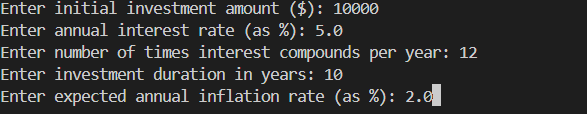
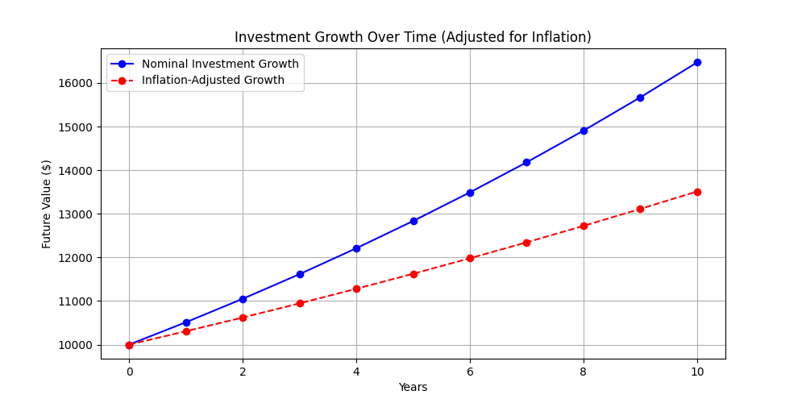

# Investment Growth & Inflation Adjustment Model

This project provides a financial model that calculates the future value of an investment while considering compound interest and the effects of inflation. The model allows users to input their investment parameters and visualize the impact of inflation over time.

## Features

- **Calculates future investment value** using compound interest.
- **Adjusts investment growth for inflation** to reflect real purchasing power.
- **User input functionality** for customization of investment parameters.
- **Graphical visualization** of nominal and inflation-adjusted investment growth.

## Formulae Used

### 1. Compound Interest Formula

The future value of an investment considering compound interest is given by:

$$
FV = P \times \left(1 + \frac{r}{n} \right)^{n \times t}
$$

Where:

- \( FV \) = Future Value
- \( P \) = Principal Investment Amount
- \( r \) = Annual Interest Rate (decimal form)
- \( n \) = Number of times interest is compounded per year
- \( t \) = Number of years

### 2. Inflation Adjustment Formula

git add .
git commit -m "Added investment analysis project with inflation adjustment"
git commit -am "Latest updates"$$
Adjusted\ Value = \frac{FV}{(1 + inflation_rate)^{years}}

$$

Where:

- \( Adjusted\ Value \) = Inflation-adjusted future value
- \( FV \) = Future Value calculated from compound interest
- \( inflation_rate \) = Annual inflation rate (decimal form)
- \( years \) = Number of years

## Technologies Used

- **Python 3.12**
- **Libraries:** `numpy`, `matplotlib`

## User Inputs

The model takes the following inputs:

- **Initial Investment Amount ($)**
- **Annual Interest Rate (%)**
- **Compounding Frequency (times per year)**
- **Investment Duration (years)**
- **Expected Annual Inflation Rate (%)**

### Example User Inputs



## Results & Visualization

### 1. Investment Growth Over Time

The blue solid line represents the **nominal investment growth**, while the red dashed line represents **inflation-adjusted growth**.



### 2. Console Output Example

```
Enter initial investment amount ($): 10000
Enter annual interest rate (as %): 5.0
Enter number of times interest compounds per year: 12
Enter investment duration in years: 10
Enter expected annual inflation rate (as %): 2.0
Future Value (FV) after 10 years: $16470.09
Inflation-Adjusted Future Value: $13490.29
```

## How to Run the Code

1. Install dependencies:
   ```bash
   pip install numpy matplotlib
   ```
2. Run the Python script:
   ```bash
   python main.py
   ```
3. Enter required input values when prompted.
4. View results in the console and generated graph.

## Next Steps

- Extend the model to include different interest calculation methods.
- Add portfolio optimization and risk analysis features.

---

This project is an educational tool for financial modeling and investment analysis. Contributions and improvements are welcome!
$$
